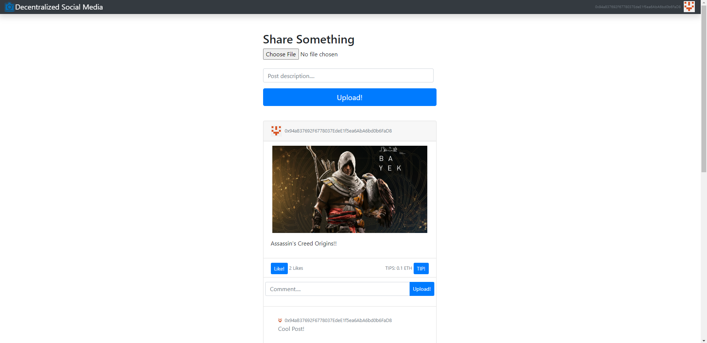

# Decentralized Socail Media

As the Name suggests, it is a decentralized social media application. With the user-friendly interface, creators can post the content into the application by paying a small amount of ethers for confirming the transaction. After posting, the content can be viewed, liekd as well as commented on the application and another interesting feature is tipping of content posted. People can directly tip their liked content where the ethers would directly go to the creator’s account.

### Demo



### Prerequisites

- Make sure you have Ganache installed on your machine. You can download from [here](https://trufflesuite.com/ganache/)
- Add Metamask extension to your broser. This will help connect the application connect to test ethereum network.
- Make sure you have Ganache network added and selected in Metamask
- Import Ganache testing accounts to Metamask:

1. Opt Import using seed phrase.
2. If you don't see an option there, click Import existing account.
3. Paste 12 word phrase from Ganache to Metamask and create a new Password.

## How to run

- Install the dependencies

```
npm install
```

- Initialize truffle (truffle will ask to update test and config, deny it)

```
truffle init
```

- reset any existing smart contracts

```
truffle migrate --reset
```

- Initialize server

```
npm start
```

## How to test Smart Contract

- Run this command

```
truffle test
```
